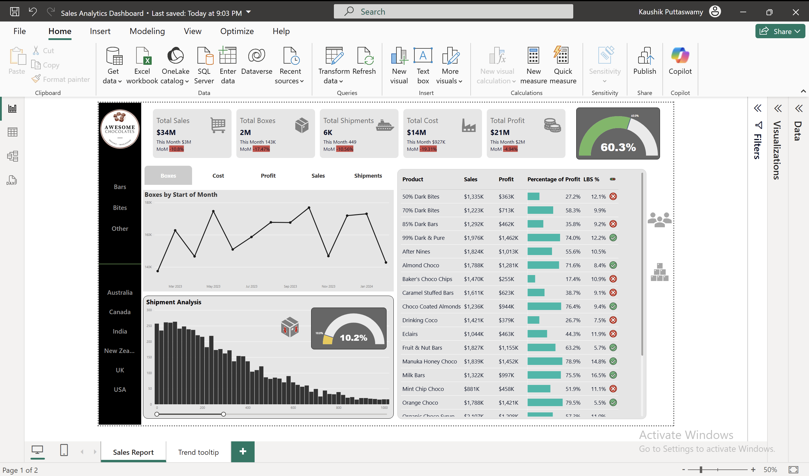

# Sales-Analytics-Dashboard-Using-Power-BI

📊 Sales Analytics Dashboard - Power BI

📝 Overview

The **Sales Analytics Dashboard** provides a comprehensive analysis of Awesome Chocolates company’s sales performance. It offers interactive visualizations of key business metrics such as total sales, shipments, costs, profit margins, and product-wise performance. The dashboard is designed to help stakeholders make data-driven decisions and identify trends in sales.

📂 Project Files
	•	📊 Power BI File: Sales Analytics Dashboard.pbix
	•	📄 PDF Report: Sales Analytics Dashboard.pdf
	•	🖼️ Dashboard Screenshot: 
	•	🌐 Live Power BI Report: View Dashboard
